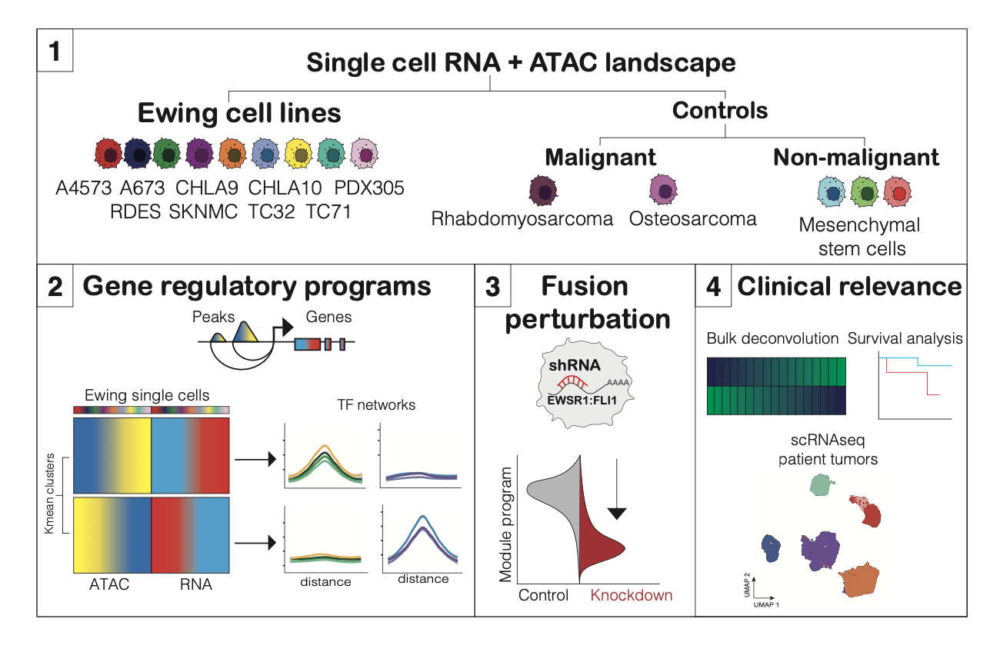

# Multimodal single cell analyses reveal distinct fusion regulated transcriptional programs in Ewing sarcoma

<!--  -->

</a>

This repository hosts code notebooks used to generate figures from the above titled manuscript.

**Processed, seurat objects are hosted [here](https://zenodo.org/records/12209095).**

</a>

